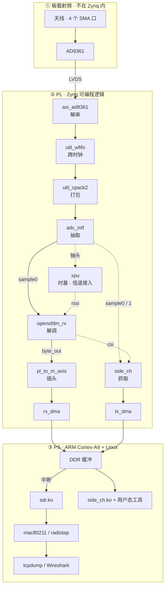

# OpenWiFi 接收链路：从电磁波到 WiFi 帧

适用于 AntSDR E316（XC7Z020）+ openwifi。目标读者：刚接触这套系统、需要知道"信号在哪些文件里被处理"的人。

所有文件路径均相对项目根目录 `/Users/juicy/Projects/OpenWiFi/`。

---

## 0. 读前须知：三块拼图

项目里有 **两个 git 仓库**，加 **两个未拉取的子模块**：

| 位置 | 内容 | 本地状态 |
|---|---|---|
| `openwifi-hw/` | FPGA 侧：Verilog 源码、Vivado 工程脚本、板级约束、`system.bd` | 完整 |
| `openwifi/` | 板子上跑的 Linux 侧：内核驱动、用户态工具、设备树、脚本 | 完整 |
| `openwifi-hw/adi-hdl/` | ADI 公司的 FPGA IP 库（子模块） | **空目录**，需 `git submodule update` 才有内容 |
| `openwifi-hw/ip/openofdm_rx/` | OFDM 解调器源码（子模块，来自 `github.com/open-sdr/openofdm`） | **空目录**，同上 |

后两个目录现在是空的，所以看到 `adi-hdl/library/...` 或 `openofdm_rx/verilog/...` 这类路径时，文件并不在你硬盘上，需要先拉子模块。

---

## 1. 名词解释

**硬件与架构**

| 名词 | 含义 |
|---|---|
| **Zynq-7000** | 这颗主芯片的型号。"SoC" = 一颗芯片里同时有处理器和 FPGA。 |
| **PS**（Processing System） | Zynq 里的硬核处理器部分：双核 ARM Cortex-A9 + 内存控制器 + 外设。跑 Linux。 |
| **PL**（Programmable Logic） | Zynq 里的 FPGA 可编程逻辑部分。跑 openwifi 的数字信号处理。掉电即丢配置，每次上电要由 PS 加载 bitstream。 |
| **bitstream** | PL 的"配置文件"，描述 FPGA 内部逻辑怎么连。等价于 FPGA 的程序。 |
| **IP**（在本文语境） | 不指网络协议，而是"封装好的硬件功能模块"（Intellectual Property core）。例：`xpu` 是一个 IP。 |
| **BD**（Block Design） | Vivado 里用图形界面把多个 IP 连起来的"系统框图"。保存为 `.bd` 文件。本项目对应 `boards/e310v2/src/system.bd`。 |
| **LVDS** | 一种差分串行接口标准。AD9361 用它把数据传给 FPGA。 |
| **时钟域** | 一组由同一个时钟驱动的逻辑。跨时钟域传数据需要特殊处理（同步器 / FIFO），否则会出现亚稳态错误。 |

**射频与信号**

| 名词 | 含义 |
|---|---|
| **AD9361** | Analog Devices 的射频收发器芯片。E316 的射频前端核心：负责放大、混频、滤波、ADC/DAC。 |
| **零中频** | 一种接收机架构：把射频信号直接混频到 0 Hz 附近，而不是先降到某个中间频率。好处是省滤波器，代价是要处理 I/Q 两路。 |
| **I / Q** | 同相（In-phase）与正交（Quadrature）分量。一个复数信号需要两个实数来表示，所以一路复基带信号 = I 一路 + Q 一路。 |
| **基带** | 混频、滤波之后的低频信号，还没被解调成比特。本文的"原始 IQ"就是这个。 |
| **AGC** | 自动增益控制。信号太强就减小放大倍数，太弱就加大，保证 ADC 不饱和。 |
| **MSPS** | Mega-Samples Per Second，每秒采样百万次。E316 的 ADC 跑 40 MSPS，基带是 20 Msps。 |
| **抽取**（decimation） | 每隔 N 个样本丢 N-1 个，等效降低采样率。本设计做 ÷2：40 MSPS → 20 Msps。 |
| **sample_strobe** | 基带样本"这一拍是新的"的使能脉冲：20 Msps，每个有效样本只占 1 个 100 MHz 周期，其余周期数据线保持旧值。由 `adc_intf` 的 ÷2 抽取产生，`sample0` / `sample1` 与 `openofdm_rx`、`side_ch`、`xpu` 共用同一根。 |
| **RSSI** | 接收信号强度指示，单位 dB。用来判断信号多强、信道是否空闲。本系统里由 `xpu` 用样本幅度再加上 AD9361 的 AGC 增益算出（见 3.10）。 |
| **TSF** | Timing Synchronization Function，802.11 标准规定的 1 µs 粒度计时器。本系统里它是**所有数据的统一时间基准**。 |
| **PHY / MAC** | 802.11 协议的两层。PHY = 物理层（把比特变成波形），MAC = 媒体访问控制层（谁什么时候能发）。 |
| **CSI** | Channel State Information，信道状态信息。具体说是每个子载波上的复数信道响应 H[k]，描述信号经过空间后各频率分量被怎么改变。 |
| **前导**（preamble） | 每个 802.11 帧开头的已知训练序列，接收机靠它做同步和信道估计。非 HT 帧由 L-STF（短前导）+ L-LTF（长前导）+ L-SIG 组成。 |
| **FFT** | 快速傅里叶变换。把时域波形变成频域，才能按子载波解调。 |
| **均衡**（equalization） | 用估计出的信道响应 H[k] 去除信道影响，把星座点"摆正"。 |
| **李德**（Viterbi） | 一种纠错译码算法。802.11 用卷积码 + Viterbi 译码。 |
| **FCS** | Frame Check Sequence，帧尾的 32 bit CRC 校验。校验不过说明这一帧收错了。 |

**数据搬运与软件**

| 名词 | 含义 |
|---|---|
| **AXI-Stream** | 一种"只传数据流、不带地址"的总线接口。用于样本流、字节流这类连续数据。 |
| **AXI-Lite** | 一种带地址的寄存器读写总线。CPU 用它配置 PL 里的模块（如 `sdrctl get reg xpu 63`）。 |
| **DMA** | Direct Memory Access，直接内存访问。让外设不经过 CPU 就能读写内存。 |
| **S2MM** | Stream to Memory-Mapped。DMA 的一个方向：从 PL 的数据流收进内存。 |
| **MM2S** | Memory-Mapped to Stream。DMA 的反方向：从内存读出数据送进 PL。 |
| **DDR** | 板上的内存（RAM）。 |
| **skb** | socket buffer，Linux 内核表示"一个网络包"的数据结构。 |
| **mac80211** | Linux 内核里的 WiFi 协议栈框架。驱动注册一张回调表成为它的硬件后端，由它调驱动收发；MAC 协议逻辑（队列、聚合、加密、radiotap）都在这一层。 |
| **radiotap** | monitor 模式下每个包前附加的元数据头（信号强度、时间戳、速率等）。抓包工具靠它显示无线信息。 |
| **IQ 快照** | side_ch 模块的一次性抓取：满足触发条件时，把前后一段时间的基带样本存下来。 |

---

## 2. 流水线总览



读图要点，细节都在后面各节：

- **实线是主链**（电磁波 → WiFi 帧），**虚线都是旁挂**，不是流水线的一级。`sample0` 从 `adc_intf` 出来是三处**并联抽头**（`openofdm_rx` / `side_ch` / `xpu`），谁都不转手样本；`xpu` 回送给 `openofdm_rx` 的 `rssi` 是功率标量，不是样本。`sample1`（第 2 根天线）只接 `side_ch`，图上未画。
- **跨域点只有两处**：`util_wfifo` 和 `adc_intf`。`util_clkdiv` 只供时钟、不在数据路上，故未画；完整时钟链见第 4 节。
- **名字会骗人**：解码帧走的是 `rx_dma`、`side_ch` 记录走的是 `tx_dma`（见 3.7 节）。

| 图上的节点 | 在哪一节 |
|---|---|
| 天线 / AD9361 | 3.1 / 3.2 |
| `axi_ad9361` · `util_wfifo` · `util_cpack2` | 3.3 |
| `adc_intf` | 3.4 |
| `openofdm_rx` | 3.5 |
| `pl_to_m_axis` | 3.6 |
| `rx_dma` / `tx_dma` | 3.7 |
| `sdr.ko` / mac80211 | 3.8 / 3.9 |
| `xpu` | 3.10 |
| `side_ch` | 3.11 |

---

## 3. 逐环节说明

### 3.1 天线

| 项 | 内容 |
|---|---|
| 所在域 | **① 板载射频域**（不在 Zynq 内，PL 看不到） |
| 是什么 | E316 板上的 4 个 SMA 射频接口：`TX/RX1`、`RX1`、`RX2`、`TX/RX2` |
| 相关文件 | 无 HDL 文件。天线开关由 AD9361 的 CTRL_OUT 引脚驱动，由驱动里的 `openwifi_set_antenna()` 控制 |
| 作用 | 把空间电磁波变成高频电信号（或反向） |

`TX/RX<n>` 是收发共用的口，`RX<n>` 是独立收路径。默认工作模式用的是 TX/RX1 收 + RX1 收（两路）。

### 3.2 AD9361 射频收发器

| 项 | 内容 |
|---|---|
| 所在域 | **① 板载射频域**（不是 HDL 模块，PL 看不到；由 PS 经 IIO/sysfs 配置） |
| 是什么 | 一颗芯片，不是 HDL 模块 |
| 配置方式 | Linux IIO / sysfs 接口，由启动脚本写入 |
| 相关文件 | `openwifi/user_space/rf_init.sh`（发射初始化脚本）、`openwifi/user_space/rf_init_11n.sh`（11n 版本，采样率与滤波参数不同）、驱动 `ad9361_drv.ko`（来自 ADI 内核） |

它内部依次做：

1. **LNA**：低噪声放大，把微弱的天线信号放大。
2. **混频**：用本振（LO）把射频搬到零中频。默认 LO 设 1 GHz，实际信道频率由 hostapd / `sdrctl` 通过 CRDA 配置。
3. **模拟低通**：`rf_init.sh` 里 RX 射频带宽设 **17.5 MHz**（11n 脚本用 25.215 MHz）。
4. **AGC**：`fast_attack` 模式，每个包快速收敛。
5. **ADC**：**40 MSPS**、12 bit 量化，输出 I/Q 两路实数流。

为什么配 40 MSPS 而不是 20：AD9361 以 2 倍基带速率采样（片内 RX FIR 也在这个速率上工作），PL 里再 ÷2 降到 20 Msps。官方对这套 RF / 数字中频设计的说法是换取更好的 EVM、频谱模板符合度、灵敏度与 RSSI 精度（`openwifi/doc/README.md` 的 Analog and digital frequency design 一节）：*"The IQ sampling rate between AD9361 and FPGA is 40Msps. It is converted to 20Msps via decimation/interpolation inside FPGA to WiFi baseband transceiver."*

### 3.3 ADI HDL 层（4 个 IP）

这四个是 Analog Devices 提供的基础 IP，负责"AD9361 ↔ PL"的接口。它们**不在 openwifi 的仓库里**，而在子模块 `openwifi-hw/adi-hdl/library/` 下。

**所在域**：**② PL** —— 这四个都是综合进 bitstream、跑在 FPGA 逻辑里的 IP。

另一个容易混的点：**AD9361 和这几个 IP 分属两侧**。`axi_ad9361` 及之后全是 PL；AD9361 芯片本身在 PL 之外，PL 只是通过 LVDS 引脚跟它说话。

BD 里的实例名与真实 IP 名不一样（实例名是历史遗留），对照如下：

| BD 实例名 | 真实 IP | 源码路径（在 adi-hdl 子模块内） | 作用 |
|---|---|---|---|
| `axi_ad9361` | `axi_ad9361` | `library/axi_ad9361/axi_ad9361.v` | LVDS 解串：把串行数据变成并行的 `adc_data_i0/q0/i1/q1` |
| `util_ad9361_adc_fifo` | `util_wfifo` | `library/util_wfifo/util_wfifo.v` | 跨时钟域：160 MHz → 40 MHz，缓冲相位差 |
| `util_ad9361_adc_pack` | `util_cpack2` | `library/util_cpack2/` | 把 4 路 16 bit（i0/q0/i1/q1）打包成 **1 个 64 bit 字** |
| `util_ad9361_divclk` | `util_clkdiv` | `library/xilinx/util_clkdiv/util_clkdiv.v` | 用 BUFR 把 DATA_CLK ÷4，得到 40 MHz |

**位宽在半路从 12 变成 16，这一步最容易被漏掉**。AD9361 的 ADC 只有 12 bit，LVDS 线上传的是 12 bit 二进制补码（2R2T 下一帧 = 4 个样本 = 8 个时钟沿 / 4 个完整周期，由 FRAME 信号划分）；`axi_ad9361` 内部的格式转换模块把它**符号扩展**成 16 bit —— 数值不变，不是重采样，也不是补零截断。

| 位置 | 位宽 |
|---|---|
| LVDS 线上 | **12 bit** / 样本 |
| `axi_ad9361` 输出口 `adc_data_i0/q0/i1/q1` 起 → `util_wfifo` → `util_cpack2`（4 × 16 = 64 bit）→ `adc_intf` → DDR | **16 bit** / 样本 |

ADI 工程师在论坛里给的原始链路（[EngineZone: AXI_AD9361 Data Format](https://ez.analog.com/fpga/f/q-a/112155/axi_ad9361-data-format)）：

> (RX) LVDS -> 12 bit 2's complement -> 16 bit 2's complement

官方 wiki 的对应表述：*"AXI_AD9361 supports a total of 4 channels 16bits each. This corresponds to a packed channel data width of 64bits."*

TX 方向不对称：`dac_data_*` 是 16 bit，但 AD9361 只取**高 12 位**（`TX: 16 bit 2's complement -> 12 bit 2's complement (top 12 bits) -> LVDS`），所以往 DAC 写数据要左移 4 位。RX 右对齐、TX 左对齐，两边不是镜像的。

一个容易误解的点：`adc_data_i0` 里的 `i` = I 分量，`0` = **RX 通道号**（第 0 根天线），不是"I 的第 0 路"。所以四路 = 2 根天线 × (I, Q)。

AD9361 是 2T2R（2 发 2 收），所以**上限是 2 路复基带**；而且两个 RX 通道**共享同一个 RX 本振**，两路必须同频，它是 2×2 MIMO / 分集，不是两台独立接收机。

表中那个 `util_ad9361_adc_fifo` 也不要当成通用异步 FIFO：ADI 工程师明确说 `util_wfifo` **只支持 1:1 / 1:2 / 1:4 / 1:8 的固定整数比**跨时钟（[EngineZone](https://ez.analog.com/fpga/f/q-a/586311/what-is-the-function-of-util_ad9361_adc_fifo-block-in-ad9361-reference-project)），所以它的两侧时钟必须同源——这里正是 `l_clk` 与它 ÷4 出来的 `adc_clk`。这也是为什么不能把它的读侧随手换成 PS 的另一个 100 MHz 时钟。

### 3.4 rx_intf 内的 adc_intf：抽取

| 项 | 内容 |
|---|---|
| 所在域 | **② PL**（`rx_intf` IP 内部；输入侧在 40 MHz 域，输出侧在 100 MHz 域） |
| 文件 | `openwifi-hw/ip/rx_intf/src/adc_intf.v`（177 行） |
| 例化于 | `openwifi-hw/ip/rx_intf/src/rx_intf.v` 第 323 行 |
| 输入 | 64 bit 打包字（4 路 16 bit），40 MHz 域 |
| 输出 | `sample0` = `{I0, Q0}`（32 bit）、`sample1` = `{I1, Q1}`（32 bit）、`sample_strobe` |

它做两件事：

1. **÷2 抽取**：`adc_valid_decimate = (adc_valid_count==0)`，每两个有效样本取一个 → 40 MSPS 降到 **20 Msps**（每样本 50 ns）。它只做移位对齐，不重排通道。
2. **跨时钟**：从 40 MHz 的 ADC 接口域到 100 MHz 的 PL 工作域。

**`sample0` 是整条链的关键节点**：在 BD 里它是一根线（网名 `rx_intf_0_sample`，定义见 `ip/openwifi_ip_ultra_scale.tcl` 第 327 行），三处取用（`xpu` 那处要分 I/Q，所以下面画了四条线）：

```
rx_intf_0/sample0 ─┬─→ openofdm_rx_0/sample_in        （解调器）
                   ├─→ side_ch_0/sample0_in            （IQ 快照）
                   └─→ xlslice_0/1 → xpu_0/ddc_i,ddc_q  （算 RSSI）
rx_intf_0/sample1 ───→ side_ch_0/sample1_in            （第 2 根天线，只给 IQ 用）
```

也就是说，**IQ 快照抓的和解码器吃的是同一根线上同一份样本**——这是"用 TSF 能把三种数据对上"的物理依据。`sample_strobe` 也是共用的（第 329 行，还额外送 `xpu_0/ddc_iq_valid`）。

三处都是抽头，**样本哪一处都不转手**。`xpu` 那处只把样本拿去算功率，回送给 `openofdm_rx` 和 `side_ch` 的是 `rssi_half_db` 标量，见 3.10。

同目录下还有两个相关文件：

- `openwifi-hw/ip/rx_intf/src/rx_iq_intf.v`：采样率自适应，e310v2 上基本是旁路。
- `openwifi-hw/ip/rx_intf/src/gpio_status_rf_to_bb.v`：把每个样本对应的 AGC 增益/RSSI 状态打包成状态字，后面 IQ 记录里那两个状态字段就是它给的。

### 3.5 openofdm_rx：数字解调

| 项 | 内容 |
|---|---|
| 所在域 | **② PL**（独立 IP `openofdm_rx_0`，100 MHz 域） |
| 文件 | `openwifi-hw/ip/openofdm_rx/`（**空子模块**，来自 `github.com/open-sdr/openofdm`；本地对应 pin = `2bb3ad1a1f0023bfd15168db4e196ebf0d56d76c`） |
| 顶层壳 | `verilog/openofdm_rx.v` — 只有 AXI-Lite 寄存器、看门狗，和 `dot11` 的例化 |
| 真正逻辑 | `verilog/dot11.v`（约 1190 行）— 数据通路例化 + 一个大状态机 |
| 输入 | `sample_in[31:0]` + `sample_in_strobe`（即上面的 `sample0`）；另有一路 `rssi_half_db[10:0]`，来自 `xpu` 的实时功率测量，只供第 1 级功率门比较 |
| 输出 | `byte_out[7:0]` + `byte_out_strobe`（解出的 MAC 字节流）、`pkt_rate`、`pkt_len`、`fcs_ok`、`csi`、`equalizer` |

内部是一条流水线，逐级是：

| 级 | 模块（同目录下） | 作用 |
|---|---|---|
| 1 | 功率门（`dot11.v` 内） | `rssi_half_db >= power_thres` 才启动，只是粗开关，不做判决 |
| 2 | `sync_short.v` | L-STF 的 16 样本延迟自相关，做粗同步（判断"有信号来了"） |
| 3 | `sync_long.v` | 与 L-LTF 已知序列做互相关，精确定时；并用两个 LTF 符号的相位差估计载波频偏 |
| 4 | `sync_long.v` 内的 FFT + `rot_after_fft.v` | 64 点 FFT 转到频域；分时域、频域两级补偿残余相位 |
| 5 | `equalizer.v` | 求信道响应 `H[k] = (Y1[k]+Y2[k])/2 × L_LTF[k]` —— **这就是 CSI**；之后用导频跟踪相位（CPE），输出均衡后的星座点 |
| 6 | `demodulate.v` `deinterleave.v` `viterbi` `descramble.v` `bits_to_bytes.v` + CRC32 | 解映射（BPSK/QPSK/16QAM/64QAM）→ 解交织 → Viterbi 纠错译码 → 解扰 → 装字节 → 算 FCS |

两个要点：

- **CSI 是 L-LTF 的频域信道估计**，在 FFT 之后由均衡器算出，是流水线的固定副产品，不依赖任何触发配置。只要前导同步成功就会产生，所以 **FCS 校验失败的包同样有 CSI**。
- **CSI 与解调器吃的是同一份 `sample0`**，但 CSI 在 FFT 之后，而 IQ 快照在 FFT 之前，两者之间没有"从 IQ 算 CSI"的步骤。

### 3.6 rx_intf 内的 pl_to_m_axis：插 16 字节头

| 项 | 内容 |
|---|---|
| 所在域 | **② PL**（`rx_intf` IP 内部的最后一级，100 MHz 域） |
| 文件 | `openwifi-hw/ip/rx_intf/src/rx_intf_pl_to_m_axis.v`（306 行）；字节转字由同目录 `byte_to_word_fcs_sn_insert.v`（93 行）完成 |
| 例化于 | `rx_intf.v` 第 423 行（byte_to_word）与第 440 行（pl_to_m_axis） |

两件事分工：

1. `byte_to_word_fcs_sn_insert.v`：把 8 个字节拼成一个 64 bit 字；并在 FCS 那个 strobe 上，把帧尾最后一个字节换成 `{fcs_ok, pkt_seq_num}`。
2. `rx_intf_pl_to_m_axis.v`：在帧前面插入 **2 个 64 bit 字（16 字节）的头**：

| 字 | 内容 |
|---|---|
| 字 0 | 完整 64 bit TSF，在**包头有效那一刻**（`pkt_header_valid_strobe`）锁存 |
| 字 1 | `phase_offset`、HT 聚合标志、SGI 标志、速率、帧长、包存在标志、AGC 状态、RSSI |

**时间戳是在 PL 里和帧字节一起写进 DMA 缓冲的，不是事后对齐的。** 这是"对应关系"能成立的直接原因。

### 3.7 DMA 搬运：rx_dma → DDR

| 项 | 内容 |
|---|---|
| 所在域 | **跨 ② PL 与 ③ PS**：DMA 本体是 PL 里的 IP，但描述符和缓冲区都在 PS 的 DDR 里，数据经 `S_AXI_HP3` 不经 CPU 直写内存 |
| 位置 | BD 里的 `axi_dma_1`；设备树里叫 `rx_dma`，基址 `0x80410000` |
| 连接 | `rx_intf_0/m00_axis` → `axi_dma_1/S_AXIS_S2MM`（见 `ip/openwifi_ip_ultra_scale.tcl`） |
| 驱动侧声明 | `openwifi/kernel_boot/boards/e310v2/devicetree.dts` 第 900–908 行：`sdr { dmas = <&rx_dma 1 &tx_dma 0>; dma-names = "rx_dma_s2mm","tx_dma_mm2s"; }` |

数据流：`rx_intf` 的 AXI-Stream 输出 → DMA 的 S2MM 通道 → AXI 互连 → PS 的 `S_AXI_HP3` → DDR。搬完发中断通知 CPU。

**两个 DMA 的四个通道被交叉复用**，这是本设计容易看晕的地方（BD 与设备树完全对得上）：

| DMA | 通道 | 方向 | 连到哪个 IP | 谁在用 |
|---|---|---|---|---|
| `rx_dma`（0x80410000） | S2MM | PL → DDR | `rx_intf_0/m00_axis` | `sdr.ko`：收解码帧 |
| `rx_dma`（0x80410000） | MM2S | DDR → PL | `side_ch_0/s00_axis` | `side_ch.ko`：往 side_ch 送数据 |
| `tx_dma`（0x80400000） | MM2S | DDR → PL | `tx_intf_0/s00_axis` | `sdr.ko`：发送帧 |
| `tx_dma`（0x80400000） | S2MM | PL → DDR | `side_ch_0/m00_axis` | `side_ch.ko`：收 IQ/CSI 记录 |

注意名字会骗人：**`rx_dma` 不只为接收服务，`tx_dma` 也不只为发送服务**。

### 3.8 sdr.ko：内核驱动

| 项 | 内容 |
|---|---|
| 所在域 | **③ PS**（编译成 ARM 内核模块，跑在 Linux 里） |
| 主文件 | `openwifi/driver/sdr.c`（2810 行） |
| 头文件 | `openwifi/driver/sdr.h`（寄存器/结构定义） |
| 各 IP 的驱动接口 | `openwifi/driver/rx_intf/rx_intf.c`、`driver/tx_intf/tx_intf.c`、`driver/xpu/xpu.c`、`driver/openofdm_rx/openofdm_rx.c`、`driver/openofdm_tx/openofdm_tx.c`、`driver/side_ch/side_ch.c` |
| 寄存器地址定义 | `openwifi/driver/hw_def.h` |
| DMA 驱动 | `openwifi/driver/xilinx_dma/xilinx_dma.c`（ADI 版本的 AXI DMA 驱动，单独编译） |

`sdr.ko` 做的事：申请 `rx_dma_s2mm` 通道 → DMA 完成后从 DDR 取数据 → **剥掉 16 字节头**，把字段填进帧元数据：

| 头偏移 | 字段 | 去向 |
|---|---|---|
| +0 / +4 | TSF 低 / 高 32 bit | `rx_status.mactime`，并打上 `RX_FLAG_MACTIME_START` |
| +8 | RSSI | 信号强度 |
| +10 | AGC 状态 + 包存在标志 | — |
| +12 | 帧长 | — |
| +14 | rate（含 HT / SGI / 聚合 / 相位偏移） | 速率信息 |
| +16 起 | 802.11 帧本体 | 交给 mac80211；末字节 bit7 = `fcs_ok` |

### 3.9 mac80211 → radiotap → 抓包工具

| 项 | 内容 |
|---|---|
| 所在域 | **③ PS** 的 Linux 内核自带协议栈（`net/mac80211/`），不在项目文件里 |
| 用户态配置 | `openwifi/user_space/hostapd-openwifi.conf`（AP 配置文件） |
| 观察方式 | `tcpdump -i sdr0` 或 Wireshark |

`sdr.ko` 构造 skb 交给 mac80211 之后，走哪条路由**接口类型**（iftype，用 `iw` 设置，不是运行时开关）决定：

- **正常模式**（`managed` / `AP` 这类协议接口；openwifi 脚本 `nic_back_to_normal.sh` 里就是 `iwconfig mode managed`）：包进协议栈，AP 模式下走认证/关联/数据转发。
- **monitor 模式**（`iw dev sdr0 set type monitor`，切换前须 `ip link set down`）：包会被附上 radiotap 头——注意这是 **mac80211 的 rx 路径拿驱动填好的 `rx_status` 组装出来的，不是驱动加的**。**radiotap 的 TSFT 字段就是 `rx_status.mactime`**，即那个 TSF，所以抓到的每一帧都自带与 IQ、CSI 同源的时间戳。
- **另一级过滤在 FPGA 里**，两级都放开才收得到全部帧：`openwifi_configure_filter` 把标志写进 `xpu/pkt_filter_ctl.v`，monitor 时置 `MONITOR_ALL`，连 CRC 错帧和控制帧（ACK）都送上来。mac80211 不直接告知驱动 iftype，驱动靠 `(filter_flag&0xf0)==0xf0` 反推（`sdr.c:2103`）。

反过来，发包时是**框架调驱动**：mac80211 把已经成形（该加密的加密完、该聚合的聚合完）的 802.11 MPDU 交给 `openwifi_ops.tx`，驱动只管塞进 DMA；发完再把 ACK / 重传次数经 `ieee80211_tx_status_irqsafe` 回报给框架。驱动是挂上去的硬件后端，不是包的起点或终点。

### 3.10 旁挂模块之一：xpu

| 项 | 内容 |
|---|---|
| 所在域 | **② PL**（独立 IP `xpu_0`，100 MHz 域） |
| 目录 | `openwifi-hw/ip/xpu/src/` |
| 顶层 | `xpu.v`（868 行） |
| 驱动 | `openwifi/driver/xpu/xpu.c` |

**它是 openwifi 的"低 MAC + 测量 + 时基"单元**：Linux / mac80211 只把参数写进寄存器（信道、MAC/BSSID、队列、门限），µs 级的判断由它现场做——这正是 openwifi 能做出 µs 级 SIFS 与 ACK 间隔的原因。按职责分四组：

| 组 | 子模块 | 干什么 | 寄存器 |
|---|---|---|---|
| 时基 | `tsf_timer.v` | 64 bit TSF，写 reg2/3 可重载 | 写 2/3、读 58/59 |
| 测量与信道接入 | `rssi.v`（内含 `iq_abs_avg` `iq_rssi_to_db` `fifo_sample_delay`）、`cca.v`、`csma_ca.v`、`cw_exp.v`、`time_slice_gen.v` | 测 RSSI → 判信道忙闲 → DIFS/EIFS/NAV/退避/竞争窗口/队列时间片 | 5/6/7/8/19–22 |
| 发送时序 | `tx_control.v`、`tx_on_detection.v`、`spi.v` | µs 级启动 TX、等 ACK/CTS、重传、收发切换 | 1/9/10/11/13/16/17/18/26 |
| 收包过滤 | `phy_rx_parse.v`、`pkt_filter_ctl.v` | 解析收到的 MAC 头，按规则决定哪些包送 ARM | 12/27/28/29/30/31 |

（另两个是配套：`xpu_s_axi.v` 是 AXI-Lite 从口，`edge_to_flip.v` 只是边沿检测小工具。寄存器含义见 `openwifi/doc/README.md` 的 xpu 表。）

**RSSI 为什么在 xpu 里算，而不是在解码器里算**：它不是一个纯粹的样本运算，而是"数字幅度 + 射频增益"的合成，`rssi.v:103` 一行就能看清：

```
rssi_half_db = 校准偏移 + iq_rssi_half_db − AGC增益 × 2
               reg7[26:16]   样本算出，0.5 dB/步   gpio_status[6:0]
```

前半段是样本幅度经 `iq_abs_avg`（先去 DC，再取 `(|I|+|Q|)/2` 的滑动平均，是**平均幅度**不是功率）→ `iq_rssi_to_db`（折成 0.5 dB 步进的 half-dB）算出的值，后半段是 AD9361 报回的当前增益档位（每档 0.5 dB，故 ×2）。**少了增益档位就只能得到"数字幅度"，得不到 dBm**；而这个字走的是慢速控制面，要跟 20 Msps 的样本对齐还得靠 `fifo_sample_delay` 按样本数延迟（延迟量配在 reg7[6:0]）。采样链路里同时握有样本和增益字的只有 xpu。另一层原因是 RSSI 的头号消费者本来就是信道接入（`cca` 判忙闲、`csma_ca` 排退避），测量点放在 xpu 才能内部闭环；而 `openofdm_rx` 是外部解码器，它把功率门设计成"外部喂我功率"——只有 `POWER_THRES` 门限寄存器，不负责测量。

它**只从 `sample0` 上抽头，既不串联在样本通路里，也不转发样本**：经 `xlslice_0/1` 分出 I/Q 两半送 `ddc_i`/`ddc_q`，`rssi.v` 由这份样本加上 AGC 增益算出 `rssi_half_db`（11 bit，0.5 dB 步进，见上）。做成抽头而不是串联一级，是因为在 100 MHz 域里 `sample0` 就是一束线，挂个 `xlslice` 不花任何逻辑。

- **`tsf_runtime_val` 是全系统唯一的时基源头**。解码帧头的 TSF、CSI 记录头的 TSF、IQ 记录头的 TSF，全都锁存自它。
- **`rssi_half_db` 是一份共享的测量值，不是门限**，有五个取用者：`openofdm_rx` 拿它跟自己寄存器 reg2 的 `POWER_THRES`（初值 124，约 −85 dBm）比，低于门限就不启动解调；`side_ch` 拿它跟 reg9 比做 RSSI 过阈触发，并逐样本写进 IQ 记录；`rx_intf` 用 `rssi_half_db_lock_by_sig_valid`（在收到帧头 `pkt_header_valid_strobe` 那一刻锁存的那份，名字里的 sig_valid 是遗留叫法）填 16 字节头，最终变成 mac80211 上报的 signal；软件可从 reg57 读出（`rssi_openwifi_show.sh`）；xpu 自己的 CCA 拿它跟 reg8 比得到信道忙闲。
- `channel`（`slv_reg4[15:0]`，软件写入的信道号）送给 `tx_intf` 用于发送侧信道切换，不参与接收频偏换算。
- `FC_DI` / `addr1~3` 解析结果送给 `side_ch`，用作 CSI 与 IQ 的过滤条件。
- `block_rx_dma_to_ps`：信道忙时掐住送往 ARM 的通路。
- **`spi.v`（`spi_module`）在包级接管 AD9361 的 SPI 总线**：PS 的 SPI 三根线是它的输入，它只在 CPU 没选中片选时抢占总线，发一条 24 bit 寄存器写来开关 TX LO（发包前开、发完关）。两条命令的取值由 `boards/ip_repo_gen.tcl` 生成，默认控 LO，也可改成切换 RF 端口 A/B。官方说这是做到 self-interference free 和 0.6 µs 收发切换的关键（`openwifi/doc/README.md`）。
- **默认在自发窗口里掐掉 Rx 基带**，所以那段时间的 RSSI / IQ 不能当接收数据用；要抓自发信号得先解静音：`sdrctl dev sdr0 set reg xpu 1 1`（`doc/app_notes/iq.md`）。

### 3.11 旁挂模块之二：side_ch（取 CSI / IQ 的通道）

| 项 | 内容 |
|---|---|
| 所在域 | **跨 ② PL 与 ③ PS**：抓取与缓存逻辑在 PL（独立 IP `side_ch_0`），驱动 `side_ch.ko` 与用户态工具在 ARM 上 |
| 目录 | `openwifi-hw/ip/side_ch/src/` |
| 顶层 | `side_ch.v`（541 行）；核心状态机在 `side_ch_control.v`（885 行）；AXIS 接口 `side_ch_m_axis.v` `side_ch_s_axis.v`；缓冲 `dpram.v` |
| 例化与连接 | `openwifi-hw/ip/openwifi_ip_ultra_scale.tcl` 第 224–278 行 |
| 驱动 | `openwifi/driver/side_ch/side_ch.c`（681 行）、`side_ch.h` |
| 用户态 | `openwifi/user_space/side_ch_ctl_src/side_ch_ctl.c`、`iq_capture.py`（IQ 抓取）、`iq_capture_2ant.py`（双天线）、`side_info_display.py`（显示） |
| 文档 | `openwifi/doc/app_notes/csi.md`、`openwifi/doc/app_notes/iq.md`、`openwifi/doc/app_notes/iq_2ant.md` |

它是一条**只读旁路**：从主链上"监听"信号，搬给 PS 供观察，不参与通信。

输入分两类：

- **时域样本**：`sample0_in`（主天线）、`sample1_in`（第二根天线）；
- **解调器中间量**：`csi`（56 个子载波的信道估计）、`equalizer`（均衡后的数据符号）、`pkt_len` / `pkt_rate` / `fcs_ok` 等。

它有两种工作模式，**用 `insmod side_ch.ko iq_len_init=N` 里的 N 选择**：

| 模式 | 条件 | 每次产出 |
|---|---|---|
| **CSI 模式** | N = 0 | 一条 CSI 记录：2 项 TSF/频偏 + 56 项 CSI + 若干均衡后符号 |
| **IQ 模式** | N > 0 | 一次快照：1 项触发时刻 TSF + `iq_len` 个基带样本 |

两种模式**互斥**：它们在 `side_ch_control.v` 里汇入同一个二选一选择器（第 313–314 行），共用一条 FIFO、一条 DMA 通道、一套定长记录协议和一组复用寄存器。这是搬运层的设计取舍，不是数据源的限制——数据源本来就是同一份 `sample0`。

另外两点：

- side_ch 的记录送到 PS 走的是 **`tx_dma`（0x80400000）的 S2MM 通道**，与解码帧走的 `rx_dma` 是两条独立通道。
- IQ 触发条件有 32 种可选（`side_ch_control.v` 第 583–616 行），包括 FCS 完成、前导检测、RSSI 阈值、地址匹配等；其中一个选项是**地址匹配**，与 CSI 模式的过滤共用同一批寄存器——这意味着切换模式做分时采集时，两阶段可以选中同一批包。

---

## 4. 时钟域

这一节的四个域都在总览图的 **② PL** 里（**①** 是 AD9361 自己的采样域）。**③** PS 与 PL 的接触面只有两处：100 MHz 的 AXI 控制面（PS 的 `M_AXI_GP0`/`GP1`）和两个 DMA 的 AXI 主口（走 `S_AXI_HP3` 进 DDR）。PL 里有 6 个物理时钟域，沿接收链看只需关心四个：

| 域 | 频率 | 来源 | 覆盖 |
|---|---|---|---|
| `l_clk`（DATA_CLK） | **160 MHz** | AD9361 回送 = 4 × 40 MSPS | `axi_ad9361` 解串、FIFO 写侧 |
| `adc_clk`（divclk） | **40 MHz** | `util_clkdiv` 把 DATA_CLK ÷4 | FIFO 读侧、打包、`adc_intf` 输入侧 |
| `clk`（PL 工作时钟） | **100 MHz** | `clk_wiz_0` 从 40 MHz 倍频 | **全部 openwifi IP**（含它们的 `s00_axi_aclk` / `m00_axis_aclk`）、两个 DMA、三个 AXI 互连、PS 的 `M_AXI_GP1` |
| `sys_cpu_clk` | 100 MHz | PS 的 FCLK_CLK0 | PS 侧控制互连（GP0：`axi_ad9361`、`axi_gpreg`、IIC）、`xpu_0/ps_clk` |

`divclk = 40 MHz` 这一点由 `openwifi-hw/boards/post_script_common.tcl` 第 10 行显式声明，板级约束 `boards/e310v2/src/system.xdc` 里也有对应的时钟定义。

100 MHz ÷ 20 Msps = **每个基带样本有 5 个时钟周期**给解码器用（常量定义在 `openwifi-hw/ip/board_def.v`）。

**RF 与基带同源**：整条时钟链都是从 AD9361 回送的 DATA_CLK 派生下来的（`l_clk` 160 MHz → BUFR ÷4 → 40 MHz → `clk_wiz_0` 倍频到 100 MHz，配置见 `system.bd` 里 `clk_wiz_0` 的 `PRIM_IN_FREQ=40` / `CLKOUT1_REQUESTED_OUT_FREQ=100`），所以射频采样和基带处理之间不存在时钟漂移 / 微小失配。这是官方明确强调的一点（`openwifi/doc/README.md` 的 Analog and digital frequency design 一节）。

**这两路的名字会骗人**：`clk_wiz_0` 的输出在 `system.bd` 里的网络名是 `sys_ps7_FCLK_CLK2`（其实不是 PS 的 FCLK），进了 `openwifi_ip` 之后端口名又叫 `m_axi_mm2s_aclk`（其实远不止 AXI 主口用）。它才是 PL 数据面的工作时钟；PS 真正出给 PL 的时钟只有 FCLK_CLK0（`sys_cpu_clk`）。

**一条硬约束**：`clk_wiz_0` 是按 40 MHz 输入配出 100 MHz 的，而 divclk 又是 AD9361 采样率的直接函数。所以**改采样率必须重综合 PL**，不是纯软件参数。

---

## 5. 文件清单总表

| 环节 | 主要文件 | 所在域 |
|---|---|---|
| 板级顶层 | `openwifi-hw/boards/e310v2/src/system_top.v`、`system_wrapper.v` | ② PL 顶层（里面例化 PS7 与整个 `openwifi_ip`） |
| 板级约束 | `openwifi-hw/boards/e310v2/src/system.xdc` | ② PL 引脚/时钟约束 |
| 系统连接（BD） | `openwifi-hw/boards/e310v2/src/system.bd` | ② PL 为主，③ PS7 也在其中被例化 |
| BD 生成脚本 | `openwifi-hw/ip/openwifi_ip_ultra_scale.tcl`、`openwifi-hw/boards/post_script_common.tcl` | 构建期（PC 上的 Vivado），不随设计上板 |
| 板级引脚/文件清单 | `openwifi-hw/boards/e310v2/set_files.tcl` | 构建期（PC 上的 Vivado） |
| 全局参数 | `openwifi-hw/ip/board_def.v` | 跨 ②/③ 的公共常量（采样率、每样本时钟数） |
| ADI HDL 层 | `openwifi-hw/adi-hdl/library/`（子模块，需拉取） | ② PL |
| 抽取与组包 | `openwifi-hw/ip/rx_intf/src/adc_intf.v`、`rx_intf_pl_to_m_axis.v`、`byte_to_word_fcs_sn_insert.v`、`rx_intf.v` | ② PL |
| 解调 | `openwifi-hw/ip/openofdm_rx/verilog/`（子模块，需拉取） | ② PL |
| 发送 | `openwifi-hw/ip/tx_intf/src/tx_intf.v`、`openwifi-hw/ip/openofdm_tx/src/dot11_tx.v` | ② PL |
| 时基与 MAC | `openwifi-hw/ip/xpu/src/xpu.v` 及同目录子模块 | ② PL |
| CSI / IQ 旁路 | `openwifi-hw/ip/side_ch/src/side_ch.v`、`side_ch_control.v` | ② PL |
| 驱动 | `openwifi/driver/sdr.c`、`hw_def.h`、`driver/xilinx_dma/xilinx_dma.c`、各 IP 同名子目录 | ③ PS 内核（驱动用 AXI-Lite 反向配置 ② 里的 IP） |
| side_ch 驱动 | `openwifi/driver/side_ch/side_ch.c` | ③ PS 内核 |
| 用户态工具 | `openwifi/user_space/side_ch_ctl_src/side_ch_ctl.c`、`iq_capture.py` | ③ PS 用户态（ARM 上的 Linux 进程） |
| 射频初始化 | `openwifi/user_space/rf_init.sh`、`rf_init_11n.sh` | ③ PS 用户态，经 IIO/sysfs 配置 ① 的 AD9361 |
| 设备树 | `openwifi/kernel_boot/boards/e310v2/devicetree.dts` | ③ PS（描述 ② 里各 IP 的地址与 DMA 通道） |
| 文档 | `openwifi/doc/app_notes/csi.md`、`iq.md`、`iq_2ant.md` | 仓库文档，不对应硬件 |

---

## 6. 三种数据为什么能对齐

上位机能拿到的三样东西——**解码帧**、**CSI 记录**、**IQ 快照**——之所以能按时间对应，靠三条：

1. **同一份样本**。`sample0` 一根线同时接给 `openofdm_rx`、`side_ch` 和 `xpu`（见 `system.bd` 的网络 `rx_intf_0_sample`）。三者是同一份数据的三个切面，不是三次独立采集。
2. **同一个时基**。三者的时间戳都锁存自 `xpu` 的 `tsf_runtime_val`：解码帧在包头有效时刻锁存，CSI 记录在包头有效时刻锁存，IQ 快照在触发事件时刻锁存。
3. **时间戳和数据一起搬**。16 字节头（帧）与记录头（CSI/IQ）都在 PL 里就拼好了，随数据一同进 DMA，不存在"事后打时间戳"的误差。

**一个例外要记牢**：IQ 记录里的 TSF 是**触发条件命中的那一刻**，本身不一定等于任何包的 TSF。触发源选 FCS 成功 / 前导检测时它才和包直接对应；选 RSSI 过阈、AGC 这类与包无关的源时，它只是时间轴上的一个点。而且 IQ 是"触发点前后各一段"的记录，触发点落在下标 `pre_trigger_len` 处，所以窗口起点是 TSF − `pre_trigger_len`/20 µs。官方给的用法就是用这个区间去 wireshark 里按 `wlan_radio.timestamp` 过滤找对应包（[Discussion #344](https://github.com/open-sdr/openwifi/discussions/344)）。

对齐精度的上限来自 TSF 的粒度：**1 µs**。IQ 记录里没有逐样本计数器，要做到样本级定位只能在上位机用前导相关自己算。
